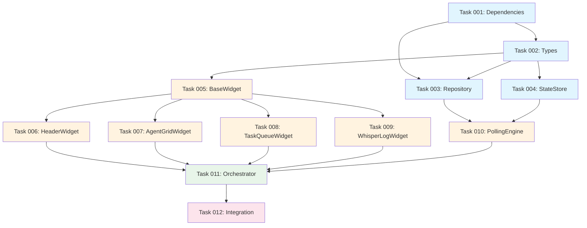

# Epic Summary: Dashboard Renderer

**Epic ID**: dashboard-renderer
**Total Tasks**: 12
**PRD Reference**: `.claude/prds/dashboard-renderer.md`

---

## Task Overview

| Task | Name | Category | Dependencies |
|------|------|----------|--------------|
| 001 | Dependencies & Project Config | Foundation | - |
| 002 | Dashboard Types & Configuration | Foundation | 001 |
| 003 | DashboardRepository (DB Reader) | Foundation | 001, 002 |
| 004 | StateStore (In-Memory Cache) | Foundation | 002 |
| 005 | BaseWidget Abstract Class | Core | 002 |
| 006 | HeaderWidget | Core | 005 |
| 007 | AgentGridWidget | Core | 005 |
| 008 | TaskQueueWidget | Core | 005 |
| 009 | WhisperLogWidget | Core | 005 |
| 010 | PollingEngine | Core | 003, 004 |
| 011 | DashboardRenderer Orchestrator | Integration | 006-010 |
| 012 | Keyboard Navigation & Integration Tests | Testing | 011 |

---

## Dependency Graph



---

## Parallel Execution Plan (Waves)

### Wave 1: Foundation (Sequential)
```
Task 001 → Task 002 → Task 003/004 (parallel)
```
*Tasks 003 and 004 can run in parallel after 002*

### Wave 2: Widgets (Parallel)
```
Task 005 → ┬─ Task 006 (HeaderWidget)
           ├─ Task 007 (AgentGridWidget)
           ├─ Task 008 (TaskQueueWidget)
           └─ Task 009 (WhisperLogWidget)
```
*All widget tasks can run in parallel after BaseWidget*

### Wave 3: Engine & Orchestrator (Sequential)
```
Task 010 → Task 011
```
*PollingEngine must complete before Orchestrator*

### Wave 4: Integration (Sequential)
```
Task 011 → Task 012
```
*Final integration and keyboard navigation*

---

## Worktree Setup

```bash
# Create and navigate to worktree
cd C:\Users\mreev\Desktop\Projects\ASF_Agent_Dashboard
git worktree add -b feature/dashboard-renderer worktrees/dashboard-renderer

# Navigate to worktree
cd worktrees/dashboard-renderer
claude
```

---

## Acceptance Criteria (Epic Level)

- [ ] All 12 tasks completed with tests passing
- [ ] Test coverage > 80%
- [ ] Dashboard renders at 60fps with 15 agents
- [ ] Update latency < 500ms from DB change
- [ ] Stable for 1+ hour continuous operation
- [ ] Keyboard navigation functional (arrows, q, r, etc.)
- [ ] Clean public API export from `src/dashboard`

---

## Technical Notes

### Dependencies to Install
```bash
npm install neo-blessed blessed-contrib
npm install -D @types/blessed
```

### Key Design Decisions
1. **Read-only DB access**: Dashboard never writes to SwarmPulse DB
2. **Polling over events**: Simpler, more resilient to agent restarts
3. **In-memory state**: StateStore caches last poll for diffing
4. **Widget abstraction**: BaseWidget ensures consistent lifecycle

---

**Next Step**: Begin implementation with Task 001: Dependencies & Project Config
