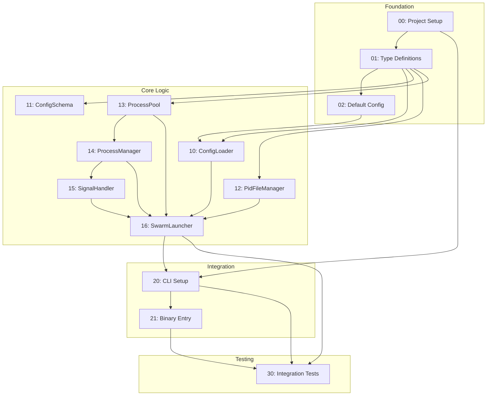

# Epic Summary: ASF Launcher

## Overview
Transform the Launcher PRD into 12 atomic, testable engineering tasks organized across 4 execution waves.

## Task Inventory

| ID | Task Name | Category | Dependencies | Est. Hours |
|----|-----------|----------|--------------|------------|
| 00 | Project Setup | Foundation | - | 1-2 |
| 01 | Type Definitions | Foundation | 00 | 1 |
| 02 | Default Configuration | Foundation | 01 | 1 |
| 10 | ConfigLoader | Core Logic | 01, 02 | 2 |
| 11 | ConfigSchema | Core Logic | 01 | 2 |
| 12 | PidFileManager | Core Logic | 01 | 1-2 |
| 13 | ProcessPool | Core Logic | 01 | 1-2 |
| 14 | ProcessManager | Core Logic | 01, 13 | 3-4 |
| 15 | SignalHandler | Core Logic | 14 | 2 |
| 16 | SwarmLauncher | Core Logic | 10, 12, 13, 14, 15 | 4-5 |
| 20 | CLI Setup | Integration | 00, 16 | 3 |
| 21 | Binary Entry Point | Integration | 20 | 1 |
| 30 | Integration Tests | Testing | 16, 20, 21 | 4 |

**Total: 12 tasks, ~24-30 hours estimated**

## Dependency Graph



## Parallel Execution Plan (Waves)

### Wave 1: Foundation (Parallel: 1 task)
```
┌─────────────────────────────────────┐
│ 00: Project Setup                   │
│     - Install dependencies          │
│     - Create directory structure    │
│     - Configure package.json        │
└─────────────────────────────────────┘
```

### Wave 2: Types & Config (Parallel: 2 tasks)
```
┌─────────────────────────────────────┐
│ 01: Type Definitions                │
│     - LauncherConfig types          │
│     - ManagedProcess types          │
│     - Event types                   │
└─────────────────────────────────────┘
         │
         ▼
┌─────────────────────────────────────┐
│ 02: Default Configuration           │
│     - defaults.ts                   │
│     - Template config file          │
└─────────────────────────────────────┘
```

### Wave 3: Core Components (Parallel: 5 tasks)
```
┌─────────────┐  ┌─────────────┐  ┌─────────────┐  ┌─────────────┐
│ 10: Config  │  │ 11: Schema  │  │ 12: PID     │  │ 13: Process │
│    Loader   │  │    Valid.   │  │    Manager  │  │    Pool     │
└─────────────┘  └─────────────┘  └─────────────┘  └─────────────┘
                                                          │
                                                          ▼
                                                   ┌─────────────┐
                                                   │ 14: Process │
                                                   │    Manager  │
                                                   └─────────────┘
                                                          │
                                                          ▼
                                                   ┌─────────────┐
                                                   │ 15: Signal  │
                                                   │    Handler  │
                                                   └─────────────┘
```

### Wave 4: Orchestrator (Sequential: 1 task)
```
┌─────────────────────────────────────┐
│ 16: SwarmLauncher                   │
│     - Main orchestrator class       │
│     - Integrates all components     │
│     - Lifecycle management          │
└─────────────────────────────────────┘
```

### Wave 5: Integration (Sequential: 2 tasks)
```
┌─────────────────────────────────────┐
│ 20: CLI Setup                       │
│     - Commander.js commands         │
│     - Option parsing                │
│     - Colorized output              │
└─────────────────────────────────────┘
         │
         ▼
┌─────────────────────────────────────┐
│ 21: Binary Entry Point              │
│     - asf-swarm executable          │
│     - Shebang handling              │
└─────────────────────────────────────┘
```

### Wave 6: Testing (Final)
```
┌─────────────────────────────────────┐
│ 30: Integration Tests               │
│     - Full lifecycle tests          │
│     - CLI integration tests         │
│     - Cross-platform tests          │
└─────────────────────────────────────┘
```

## Recommended Execution Order

For a **single developer** working sequentially:

1. **00** → Project Setup
2. **01** → Type Definitions
3. **02** → Default Config
4. **11** → ConfigSchema (standalone)
5. **10** → ConfigLoader
6. **12** → PidFileManager (standalone)
7. **13** → ProcessPool
8. **14** → ProcessManager
9. **15** → SignalHandler
10. **16** → SwarmLauncher
11. **20** → CLI Setup
12. **21** → Binary Entry
13. **30** → Integration Tests

For **parallel development** (2 developers):

| Developer A | Developer B |
|-------------|-------------|
| 00: Project Setup | - |
| 01: Type Definitions | - |
| 02: Default Config | 11: ConfigSchema |
| 10: ConfigLoader | 12: PidFileManager |
| 13: ProcessPool | (wait) |
| 14: ProcessManager | (wait) |
| 15: SignalHandler | (wait) |
| 16: SwarmLauncher | (wait) |
| 20: CLI Setup | 30: Integration Tests |
| 21: Binary Entry | (wait) |

## New Dependencies Required

```json
{
  "dependencies": {
    "commander": "^11.0.0",
    "execa": "^8.0.0",
    "ajv": "^8.0.0",
    "tree-kill": "^1.2.2",
    "chalk": "^5.0.0",
    "ora": "^7.0.0"
  }
}
```

## Success Criteria (from PRD)

- [ ] `asf-swarm start` launches dashboard and agents from config
- [ ] `asf-swarm stop` terminates all processes gracefully
- [ ] `asf-swarm status` shows accurate process information
- [ ] Ctrl+C triggers graceful shutdown of entire swarm
- [ ] No orphan processes after normal or forced shutdown
- [ ] PID file created on start, removed on stop
- [ ] `--agents N` flag overrides config agent count
- [ ] `--no-dashboard` flag starts agents only
- [ ] Invalid config produces clear error messages
- [ ] Startup sequence waits for dashboard before agents
- [ ] Exit codes reflect operation success/failure
- [ ] Works on Windows, macOS, and Linux
- [ ] All unit tests pass with >80% coverage

## Worktree Setup Command

```bash
# Create launcher feature worktree
git worktree add ../feature-launcher feature/launcher 2>/dev/null || \
  git worktree add -b feature/launcher ../feature-launcher

# Navigate to worktree
cd ../feature-launcher

# Install dependencies
npm install

# Start implementation with task-00
```

## File Structure (Final)

```
src/
├── launcher/
│   ├── index.ts                    # Public exports
│   ├── cli.ts                      # CLI entry point
│   ├── cli.test.ts                 # CLI tests
│   ├── SwarmLauncher.ts            # Main orchestrator
│   ├── SwarmLauncher.test.ts       # Unit tests
│   ├── types.ts                    # Core types
│   ├── config/
│   │   ├── ConfigLoader.ts
│   │   ├── ConfigLoader.test.ts
│   │   ├── ConfigSchema.ts
│   │   ├── ConfigSchema.test.ts
│   │   ├── defaults.ts
│   │   └── types.ts
│   ├── process/
│   │   ├── ProcessManager.ts
│   │   ├── ProcessManager.test.ts
│   │   ├── ProcessPool.ts
│   │   ├── ProcessPool.test.ts
│   │   └── types.ts
│   ├── signals/
│   │   ├── SignalHandler.ts
│   │   └── SignalHandler.test.ts
│   ├── pid/
│   │   ├── PidFileManager.ts
│   │   └── PidFileManager.test.ts
│   └── __tests__/
│       ├── integration.test.ts
│       └── cli.integration.test.ts
├── bin/
│   └── asf-swarm.ts                # Binary entry point
```

---

**Generated**: 2026-01-07
**PRD Source**: `.claude/prds/launcher.md`
**Total Tasks**: 12
**Estimated Effort**: 24-30 hours
