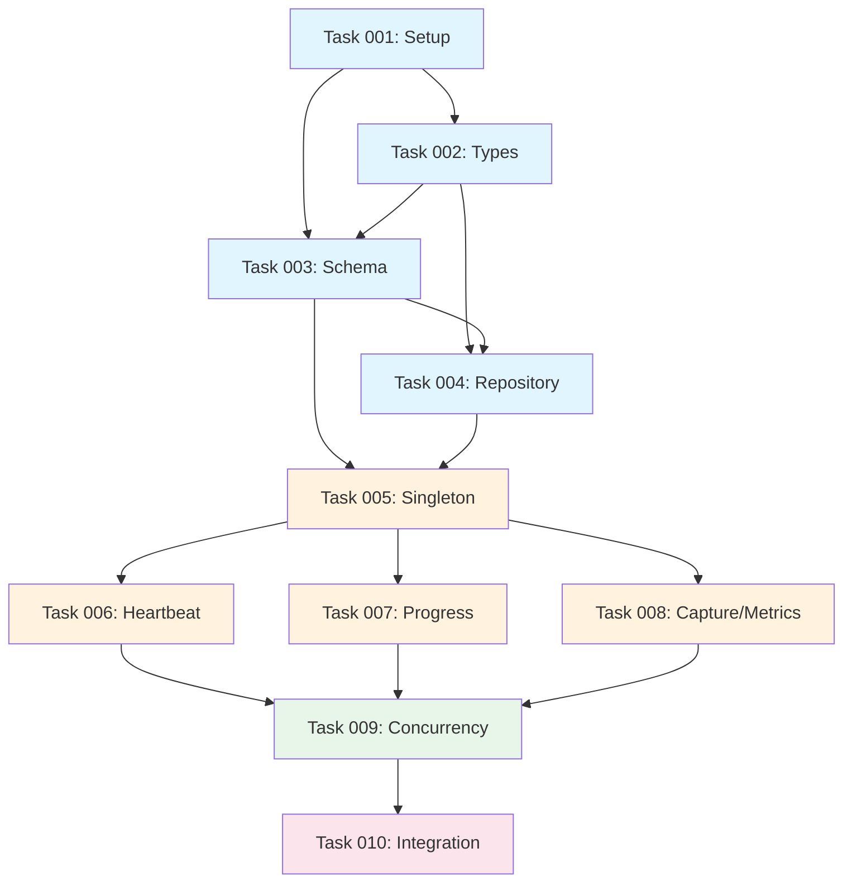

# Epic Summary: SwarmPulse SDK

**Epic ID**: swarm-pulse-sdk
**Total Tasks**: 10
**Estimated Total Time**: 16 hours
**PRD Reference**: `.claude/prds/swarm-pulse-sdk.md`

---

## Task Overview

| Task | Name | Category | Time | Dependencies |
|------|------|----------|------|--------------|
| 001 | Project Setup & Dependencies | Foundation | 1h | - |
| 002 | TypeScript Types & Interfaces | Foundation | 1h | 001 |
| 003 | Database Schema & Auto-Init | Foundation | 2h | 001, 002 |
| 004 | Repository Layer (Data Access) | Foundation | 2h | 002, 003 |
| 005 | SwarmPulse Singleton & Lifecycle | Core Logic | 2h | 003, 004 |
| 006 | Heartbeat & Status Methods | Core Logic | 1.5h | 005 |
| 007 | Progress & Task Tracking | Core Logic | 1.5h | 005 |
| 008 | Capture & Metrics Methods | Core Logic | 1.5h | 005 |
| 009 | Concurrency & Load Testing | Testing | 2h | 006, 007, 008 |
| 010 | Export & Integration Testing | Integration | 1.5h | 009 |

---

## Dependency Graph



---

## Parallel Execution Plan (Waves)

### Wave 1: Foundation (Sequential)
```
Task 001 → Task 002 → Task 003 → Task 004
```
*Must be sequential - each builds on previous*

### Wave 2: Core Methods (Parallel)
```
Task 005 → ┬─ Task 006 (Heartbeat)
           ├─ Task 007 (Progress)
           └─ Task 008 (Capture/Metrics)
```
*Tasks 006, 007, 008 can run in parallel after 005 completes*

### Wave 3: Validation (Sequential)
```
Task 009 → Task 010
```
*Final integration must be sequential*

---

## Worktree Setup

All tasks execute in the same worktree:

```bash
cd feature/swarm-pulse-sdk
claude
```

Since the SDK is a single cohesive component, parallel worktrees are not needed. However, if desired:

```bash
# Optional: Separate worktrees for parallel Wave 2 development
./scripts/setup-worktree.sh feature/swarm-pulse-heartbeat
./scripts/setup-worktree.sh feature/swarm-pulse-progress
./scripts/setup-worktree.sh feature/swarm-pulse-capture
```

---

## Acceptance Criteria (Epic Level)

- [ ] All 10 tasks completed with tests passing
- [ ] Test coverage > 80%
- [ ] Zero stdout output during SDK operations
- [ ] 15 concurrent agents supported without deadlock
- [ ] DB write latency < 10ms p99
- [ ] Clean public API export from `src/core/monitoring`

---

## Getting Started

```bash
# Navigate to worktree
cd feature/swarm-pulse-sdk

# Start implementing Task 001
# Follow TDD: Write test → Implement → Refactor
```

---

**Next Step**: Begin implementation with Task 001: Project Setup & Dependencies
